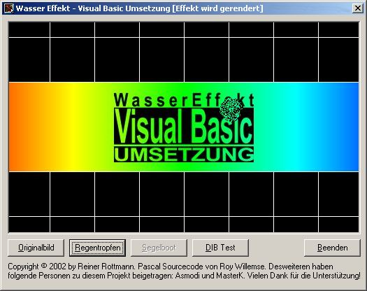



## A Realistic Water Effect

### Description

I found many interesting code snippets on Planet Source Code. And I think it is time to make a contribution to this great community.

Although there are already a few submissions available that simulate an water effect, they all seem not very realistic to me. This submission is an attempt to translate the original water effect directly to Visual Basic. Although this effect still needs some improvement on its own.

It calculates the spreadout and the damping of an simulated wave and renders the corresponding reflexions on the water. And so it looks like there is a water surface on top of the picturebox.

The sourcecode is still a work in progress and thus there are some limitations: a) the rendering speed needs to still improvement, b) the mousemove effect is still disabled due to the slow rendering and c) the effect is still not 100% correct. Vote if you think I would deserve it and please let me know your suggestions how to further improve this amazing effect...
 
### More Info
 
The source code is still a work in progress. So the program may include some unknown bugs. Sometimes the program crashes due to an read error on some mem location.

             |
---                |---
**Submitted On**   |2002-08-19 23:43:42
**By**             |[Reiner Rottmann](https://github.com/Planet-Source-Code/PSCIndex/blob/master/ByAuthor/reiner-rottmann.md)
**Level**          |Intermediate
**User Rating**    |4.0 (28 globes from 7 users)
**Compatibility**  |VB 5\.0, VB 6\.0
**Category**       |[Graphics](https://github.com/Planet-Source-Code/PSCIndex/blob/master/ByCategory/graphics__1-46.md)
**World**          |[Visual Basic](https://github.com/Planet-Source-Code/PSCIndex/blob/master/ByWorld/visual-basic.md)
**Archive File**   |[A\_Realisti1200978192002\.zip](https://github.com/Planet-Source-Code/reiner-rottmann-a-realistic-water-effect__1-37969/archive/master.zip)

